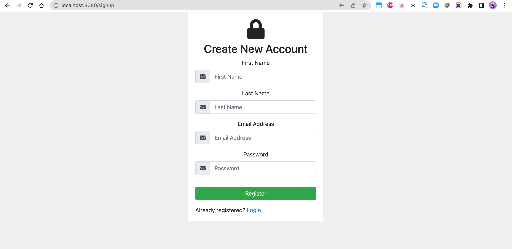
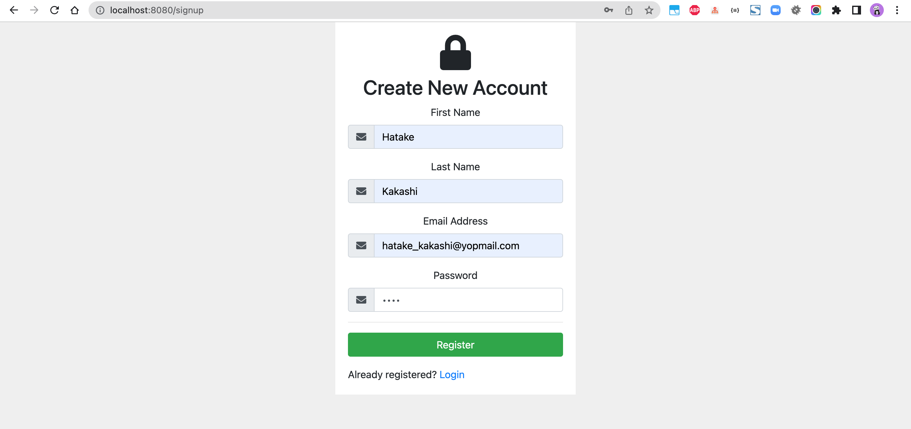
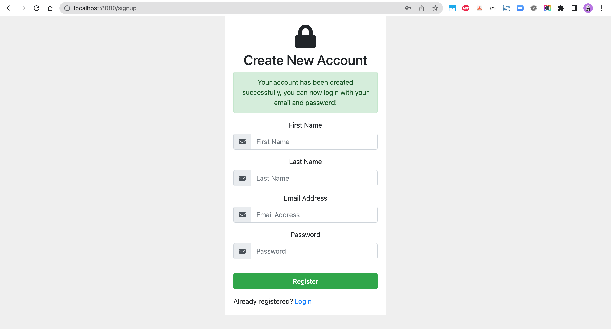
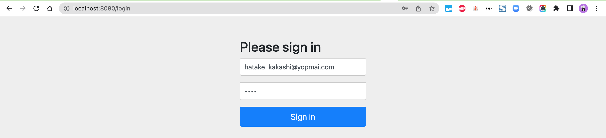
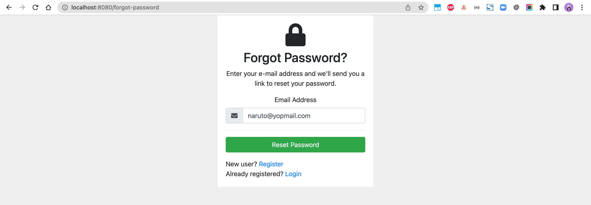
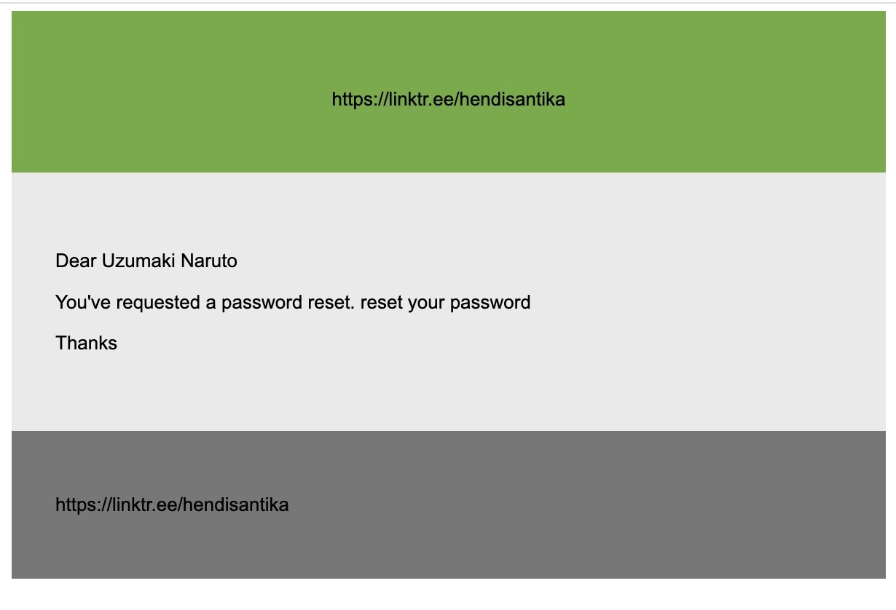
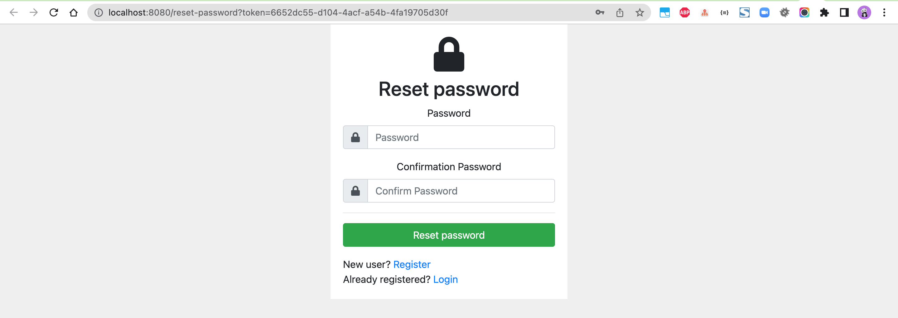

# spring-boot-forgot-password

### Things todo list:

1. Clone this repository: `git clone https://github.com/hendisantika/spring-boot-forgot-password.git`
2. Navigate to the folder: `cd spring-boot-forgot-password`
3. Replace MySQL credentials with your own in `application.properties` file
4. Run the application: `mvn clean spring-boot:run`
5. Open your favorite browser: http://localhost:8080/signup

### Image Screen shot

Sign Up Page

Login Page

Forgot Password Page

Email Inbox

Reset Password Page

